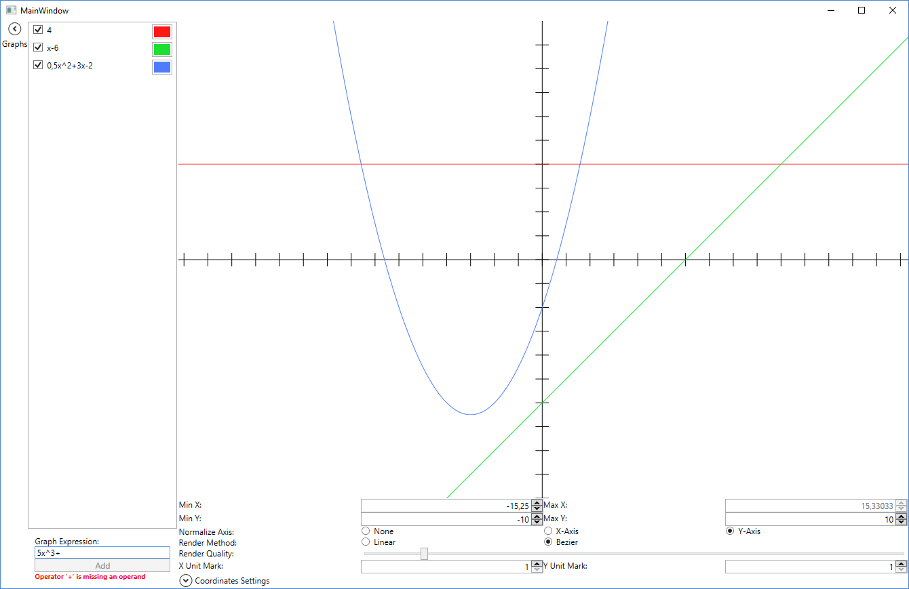

# GraphExpressionEvaluator
A small lib for compiling and evaluating simple math expressions with a variable 'x'

A small project made for fun. I felt like writing a compiler having watched some of [Jonathan Blow's](https://www.youtube.com/channel/UCCuoqzrsHlwv1YyPKLuMDUQ) talks about his own programming language.
However writing a full language compiler is a big task, and all I really wanted to do was handwriting a simple parser for fun.
So I decided to write a 'compiler' for simple mathematical expressions. 

The expressions can contain the following symbols:

- Real numbers
- The variable X
- Parenthesis ( )
- + - * / and ^ (power)

Expressions like "2x^2+3x-4" are compiled into a simple bytecode which can then be evaluated with a specific value for the variable X.

### How to use
The compiling of math expressions is done in 3 steps each represented by a class:

- <b>Lexer</b>
- <b>Parser</b>
- <b>Compiler</b>

These 3 classes can be used to create a byte string like this:

```csharp
Lexer _lexer = new Lexer();
Parser _parser = new Parser();
Compiler _compiler = new Compiler();

string expression = "2x+3";

IList<Token> tokens = _lexer.Tokenize(expression); // Turn the expression into a list of reconised tokens - no error checking
try
{
  IList<Token> rpn = _parse.Parse(tokens); // Parses the tokens into Reverse Polish Notation - will throw an exception if the expression is not valid
  byte[] bytes = _compiler.Compile(rpn); // Compile the RPN into a byte code
} 
catch (Parser.ParsingException exception)
{
  System.Console.WriteLine(exception.Message);
}
```

The compiled expression is in ```bytes``` and can be evaluated for different values of <i>X</i> like this with the <b>Interpreter</b> class:

```csharp
byte[] bytes; // contains the byte code we compiled previously for expression: 2x+3

Interpreter _interpreter = new Interpreter();

try
{
  // Evaluate 2x+3 or diferent values of X
  float xIs2 = _interpreter.Evaluate(bytes, 2); // xIs2 == 7
  float xIsNeg2 = _interpreter.Evaluate(bytes, 2); // xIsNeg2 == -1
  float xIs0 = _interpreter.Evaluate(bytes, 2); // xIs0 == 3
}
catch (InterpreterException exception)
{
  System.Console.WriteLine(exception.Message);
}
```

# GraphExpressionDrawer
To demonstrate GraphExpressionEvaluator I have created a simple WPF program that can draw the expressions as graphs.

It is quite limited in features, but it offers live evaluation and drawing of an expression as you enter it, and the choice between drawing graphs as straight line segments or as bezier segments.

